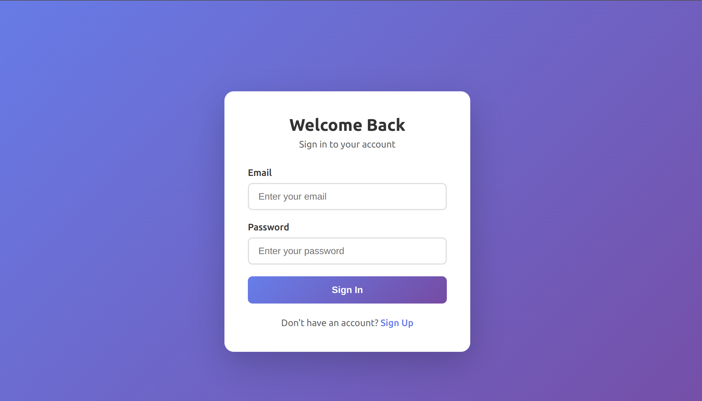
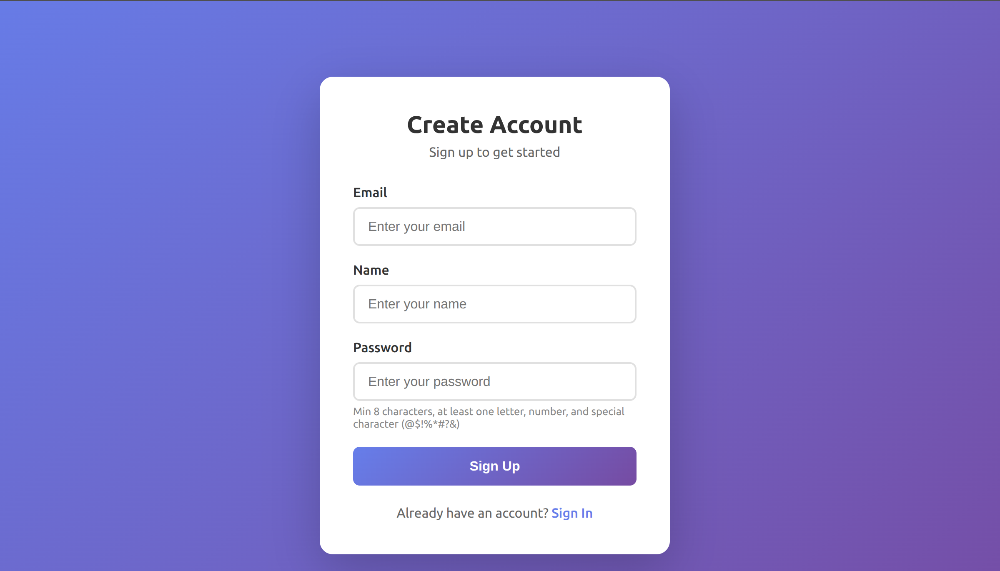
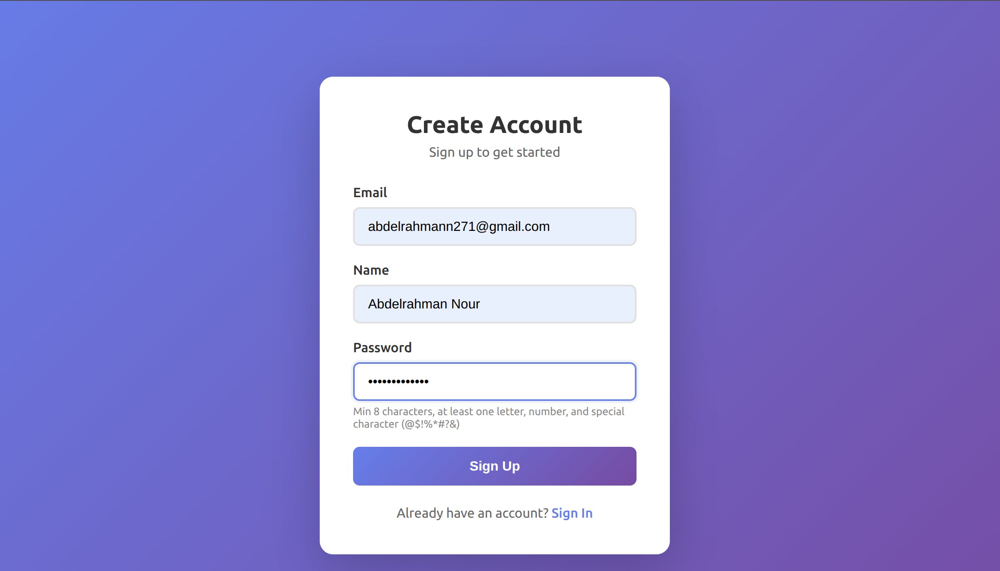
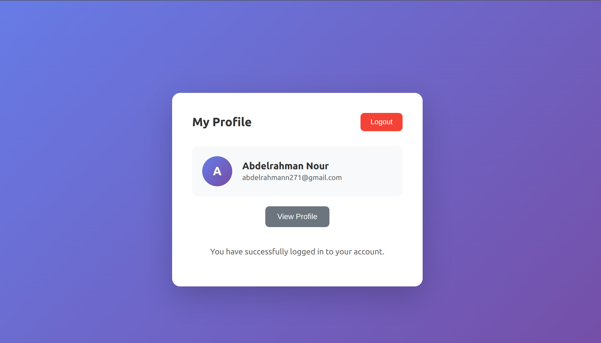
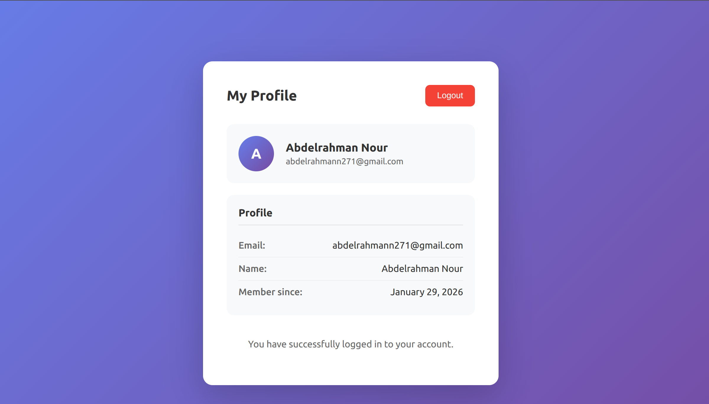

# Easy Gen App

A production-ready full-stack authentication application built with modern technologies. Features secure JWT-based authentication, a clean modular architecture, and Docker support for both development and production environments.

## Tech Stack

| Layer | Technology | Version |
|-------|------------|---------|
| **Frontend** | React | 19.x |
| | TypeScript | 5.x |
| | Vite | 7.x |
| | React Router | 7.x |
| | TanStack Query | 5.x |
| | Axios | 1.x |
| **Backend** | NestJS | 11.x |
| | TypeScript | 5.x |
| | Passport.js | 0.7.x |
| | Mongoose | 9.x |
| **Database** | MongoDB | 7.x |
| **Infrastructure** | Docker | - |
| | Nginx | Alpine |
| | Node.js | 20 LTS |

## Architecture Overview

```
Frontend (React) --> Backend (NestJS) --> MongoDB
     |                    |
   Vite (dev)         Passport.js
   Nginx (prod)       JWT Auth
```

- Backend: NestJS with modular architecture (Auth, Users modules)
- Frontend: React 19 + TypeScript + Vite
- Database: MongoDB with Mongoose ODM
- Auth: JWT tokens stored in httpOnly cookies
- Production: Nginx reverse proxy

## Features

- User registration and authentication
- JWT-based auth with httpOnly cookies
- Token invalidation on logout
- Protected routes (frontend and backend)
- Password hashing with bcrypt
- Input validation on both ends
- Swagger API documentation
- Request logging
- Rate limiting
- Docker support

## Demo

### Authentication

| Sign In | Sign Up |
|---------|---------|
|  |  |

### User Flow

| Sign Up (Filled) | Profile | Profile (Expanded) |
|------------------|---------|-------------------|
|  |  |  |

## Project Structure

```
easy-gen-app/
├── backend/                    # NestJS backend application
│   ├── src/
│   │   ├── auth/              # Authentication module
│   │   │   ├── dto/           # Data transfer objects
│   │   │   ├── guards/        # JWT and Local auth guards
│   │   │   ├── interfaces/    # TypeScript interfaces
│   │   │   └── strategies/    # Passport strategies
│   │   ├── users/             # Users module
│   │   │   ├── dto/           # User DTOs
│   │   │   └── schemas/       # Mongoose schemas
│   │   ├── common/            # Shared utilities
│   │   │   ├── filters/       # Exception filters
│   │   │   └── middleware/    # Request logging
│   │   ├── app.module.ts      # Root module
│   │   └── main.ts            # Application entry point
│   └── Dockerfile*            # Docker configurations
├── frontend/                   # React frontend application
│   ├── src/
│   │   ├── app/               # App setup and routing
│   │   │   └── routes/        # Route definitions
│   │   ├── features/          # Feature-based modules
│   │   │   ├── auth/          # Authentication feature
│   │   │   │   ├── components/
│   │   │   │   └── hooks/
│   │   │   └── profile/       # User profile feature
│   │   │       ├── components/
│   │   │       └── hooks/
│   │   └── shared/            # Shared code
│   │       ├── api/           # API client setup
│   │       ├── components/    # Reusable UI components
│   │       ├── types/         # TypeScript types
│   │       └── utils/         # Utility functions
│   └── Dockerfile*            # Docker configurations
├── docker/                     # Docker Compose files
│   ├── docker-compose.dev.yml
│   ├── docker-compose.prod.yml
│   └── nginx/                 # Nginx configuration
├── Makefile                   # Build and run commands
└── .env.*                     # Environment configurations
```

## Quick Start

Prerequisites: Docker and Docker Compose

### Development

```bash
make dev
```

- Frontend: http://localhost:5173
- Backend: http://localhost:3001
- Swagger: http://localhost:3001/api/docs

Stop: `make dev-down`

### Production

```bash
cp .env.production.example .env.production
# edit .env.production
make prod
```

- App: http://localhost
- API: http://localhost/api

Stop: `make prod-down`

### Local (without Docker)

```bash
make install
make dev-local
# then in separate terminals:
make dev-backend
make dev-frontend
```

### Using Docker Compose Directly

If you prefer not to use make, you can run docker-compose commands directly:

**Development:**
```bash
# Start all services
docker compose -f docker/docker-compose.dev.yml --env-file .env.development up -d --build

# View logs
docker compose -f docker/docker-compose.dev.yml --env-file .env.development logs -f

# Stop services
docker compose -f docker/docker-compose.dev.yml --env-file .env.development down
```

Once started, access:
- Frontend: http://localhost:5173
- Backend: http://localhost:3001
- Swagger: http://localhost:3001/api/docs
- MongoDB: mongodb://localhost:27017

**Production:**
```bash
# Start all services
docker compose -f docker/docker-compose.prod.yml --env-file .env.production up -d --build

# View logs
docker compose -f docker/docker-compose.prod.yml --env-file .env.production logs -f

# Stop services
docker compose -f docker/docker-compose.prod.yml --env-file .env.production down
```

Once started, access:
- Application: http://localhost
- API: http://localhost/api

**Utility commands:**
```bash
# Clean up (remove containers and volumes)
docker compose -f docker/docker-compose.dev.yml down -v --remove-orphans

# Open MongoDB shell (development)
docker compose -f docker/docker-compose.dev.yml --env-file .env.development exec mongodb mongosh -u easygen -p easygen_dev_password --authenticationDatabase admin easy-gen-app

# Shell into backend container
docker compose -f docker/docker-compose.dev.yml exec backend sh
```

## Configuration

Environment files:
- `.env.development` - development settings
- `.env.production` - production settings (copy from .env.production.example)

Key variables:
- `MONGO_USERNAME`, `MONGO_PASSWORD` - database credentials
- `JWT_SECRET` - token signing key (required in production)
- `JWT_EXPIRES_IN` - token expiration in seconds
- `VITE_API_URL` - backend URL for frontend

## API Documentation

Swagger docs available at `/api/docs` (development only).

### Endpoints

All endpoints use `/v1` prefix. In production, use `/api/v1/...`

- `POST /v1/auth/signup` - Register new user
- `POST /v1/auth/signin` - Sign in
- `POST /v1/auth/logout` - Log out (requires auth)
- `GET /v1/users/profile` - Get current user (requires auth)

### Request/Response Format

Signup request:
```json
{
  "email": "user@example.com",
  "name": "User Name",
  "password": "Password1!"
}
```

Error response:
```json
{
  "statusCode": 400,
  "message": "Validation failed",
  "error": "Bad Request",
  "timestamp": "2024-01-01T00:00:00.000Z",
  "path": "/v1/auth/signup"
}
```

## Logging

Backend logging:
- HTTP requests: method, URL, status, duration, IP
- Auth events: signup, login, logout
- Errors with stack traces

Log levels by environment:
- Production: error, warn, log
- Development: + debug

## Error Handling

Backend:
- Global exception filter catches all errors
- Standardized error response format
- Validation errors return detailed messages
- 4xx logged as warnings, 5xx as errors

Frontend:
- Error boundary catches React errors
- API errors handled by Axios interceptor
- 401 responses trigger logout

## Security Considerations

Authentication:
- Passwords hashed with bcrypt (10 rounds)
- JWT in httpOnly cookies (prevents XSS)
- Secure cookie flag in production
- Token versioning for logout invalidation

Rate Limiting:
- Auth endpoints: 5 requests/minute
- General: 3/s, 20/10s, 100/min

Headers (Helmet + Nginx):
- Content-Security-Policy
- X-Frame-Options
- X-Content-Type-Options
- X-XSS-Protection

Input Validation:
- DTOs with class-validator
- Whitelist mode (strips unknown fields)
- Client-side validation

Docker:
- Non-root users
- Multi-stage builds
- Internal network for MongoDB

## Testing

Run all tests:
```bash
make test
```

Backend tests:
```bash
make test-backend
```

Frontend tests:
```bash
make test-frontend
```

Coverage:
```bash
make test-cov
```

Test files:
- Backend: `*.spec.ts` (Jest)
- Frontend: `*.test.ts` (Vitest)

## Commands

Run `make help` to see all available commands.

## Troubleshooting

```bash
make dev-logs    # view dev logs
make prod-logs   # view prod logs
make clean       # remove containers
make status      # check status
```
